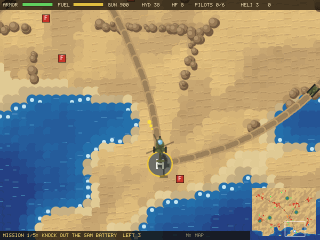
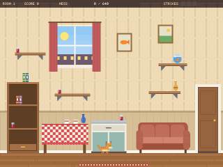
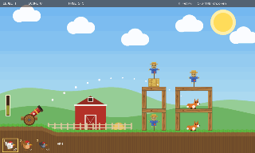
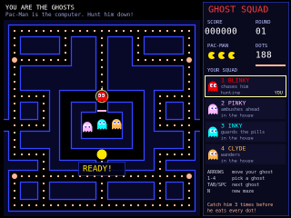
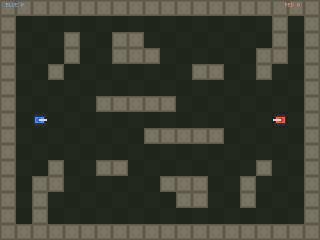

# DivJS Playground

The online home of [DivJS](https://github.com/akadjoker/divjs), the DIV Games
Studio language in the browser: an editor to write and run DIV programs, the
DIV tutorials, and over 30 games to play, read and change.

[](https://buymeacoffee.com/akadjoker)

**[▶ Open the playground](https://akadjoker.github.io/divjs-playground/)**

<table>
  <tr>
    <td align="center" width="50%"><a href="https://akadjoker.github.io/divjs-playground/playground/#p=fighter"></a><br><b>Street Duel</b><br>one-on-one fighter, specials and supers</td>
    <td align="center" width="50%"><a href="https://akadjoker.github.io/divjs-playground/playground/#p=bomber"></a><br><b>Bomber Arena</b><br>bombs, chain reactions, CPU rivals</td>
  </tr>
  <tr>
    <td align="center" width="50%"><a href="https://akadjoker.github.io/divjs-playground/playground/#p=strike"></a><br><b>Dune Strike</b><br>helicopter campaign in a generated desert</td>
    <td align="center" width="50%"><a href="https://akadjoker.github.io/divjs-playground/playground/#p=bad-cat"></a><br><b>Bad Cat</b><br>knock it all off the shelves, don't get caught</td>
  </tr>
  <tr>
    <td align="center" width="50%"><a href="https://akadjoker.github.io/divjs-playground/playground/#p=chicken-cannon"></a><br><b>Chicken Cannon</b><br>physics artillery, with chickens</td>
    <td align="center" width="50%"><a href="https://akadjoker.github.io/divjs-playground/playground/#p=ghost-squad"></a><br><b>Ghost Squad</b><br>Pac-Man, but you are the ghosts</td>
  </tr>
  <tr>
    <td align="center" width="50%"><a href="https://akadjoker.github.io/divjs-playground/playground/#p=wobbly-walker"></a><br><b>Wobbly Walker</b><br>QWOP-style ragdoll running</td>
    <td align="center" width="50%"><a href="https://akadjoker.github.io/divjs-playground/playground/#p=net-tanks"></a><br><b>Net Tanks</b><br>two players, online, no server</td>
  </tr>
  <tr>
    <td align="center" width="50%"><a href="https://akadjoker.github.io/divjs-playground/playground/#p=racer"></a><br><b>Micro racer</b><br>top-down racing on generated tracks</td>
    <td align="center" width="50%"><a href="https://akadjoker.github.io/divjs-playground/playground/#p=vector-asteroids"></a><br><b>Vector Asteroids</b><br>every rock drawn in code</td>
  </tr>
</table>

## What's here

- **The playground** (`playground/`) - an editor with DIV highlighting,
  completion and errors marked as you type, next to the running game.
  **Files** takes your own `.fpg`, `.map`, `.fnt` and `.png` files, **Share**
  copies a link with your code, **Export** downloads the game as a single
  `.html` that works offline and can go straight onto itch.io.
- **DivJS Blocks** (`blocks/`) - a Scratch-like block editor for beginners,
  with five short lessons. The blocks turn into real DIV code, shown as you
  build, that runs in the same engine and opens in the playground. Blockly is
  bundled into `blocks/vendor/` by `npm run build:blockly`.
- **The games and tutorials** (`playground/programs/`, listed in
  `manifest.json`) - every one of them is plain DIV source.
- **Demos and examples** (`demos/`, `examples/`) - pages that run a program
  on their own.
- **itch.io pages** (`itch/`) and the tools that make the GIFs and the uploads
  (`npm run capture`, `npm run itch`).

Most of the games were written by AI coding agents working from the
engine's reference - see the [DivJS README](https://github.com/akadjoker/divjs#made-by-ai-on-purpose)
for why.

## The engine

`engine/divjs.js` is the DivJS library's single-file build, pinned to a
version by the `divjs` dependency in `package.json`. To move to a new
version, change that dependency and run:

```bash
npm install
npm run engine      # copies the pinned build and its reference into engine/
```

CI checks that `engine/` is exactly the pinned version.

## Running it locally

```bash
npx serve .            # or: python3 -m http.server
# open http://localhost:3000/playground/  (port 8000 with python)
```

Tests:

```bash
npm install
npm run test:pipeline              # compiles every program, checks the list
npx playwright install chromium    # once
npm run test:browser               # every page, the playground, online play, sound
```

## Support

If DivJS made you smile, you can [buy me a coffee](https://buymeacoffee.com/akadjoker) - thank you!

## License

MIT - see [LICENSE](LICENSE). Third-party code and the files whose terms
aren't confirmed yet are listed in [THIRD_PARTY_NOTICES.md](THIRD_PARTY_NOTICES.md).
